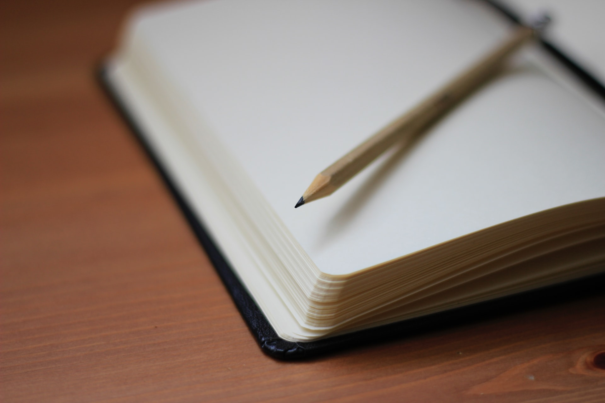

### ¿Qué es un lápiz?

Un lápiz es un utensilio utilizado para escribir o dibujar formado por un cilindro o prisma de madera con una barra de grafito en su interior.

### Historia

Los primeros indicios de lo que podríamos llamar lápiz fueron inicialmente en Cambria, Inglaterra donde a raíz del descubrimiento de una mina de grafito en 1546 se empezó a utilizar este material para marcar cosas. Debido a las propiedades físicas del grafito, Simonio y Lindiana Bernacotti quienes eran una pareja de italianos fueron los primeros en agregar un cilindro de madera alrededor del grafito para crear el primer lápiz en 1560. No fue hasta 1858 cuando Hymen Lipman tuvo la idea de añadir un borrador al final del lápiz formando lo que hoy en día conocemos como lápiz.

### Materiales

- Madera
- Grafito
- Borrador o Goma

### Diseño

Antes del lápiz ya se utilizaban otros objetos para escribir, por lo que el lápiz hereda muchas características de estos. Los primeros diseños consistían en una barrita de grafito enrollada con algún material a su alrededor para darle firmeza, esto debido a que las barritas de grafito eran delgadas  y para que la escritura fuera lo más fina posible ya que no tendría caso escribir con un lápiz de punta gruesa porque esto llegaba a ocupar más espacio en el papel. Hasta ese momento el diseño del lápiz aún tiene muchas mejoras que se pueden hacer ya que resulta incómodo ir quitando parte del material que cubre el grafito y tener que ajustarlo de nuevo. 

Es por eso que se recurre a la madera, ya que para ese entonces el ser humano ya sabía manejarla con gran precisión. La madera le dá esa firmeza que tanto necesitaba y además facilita el sacado de punta ya que la barrita de grafito al estar bien incrustada en el cuerpo de madera hace que el utilizar un cuchillo para sacarle punta al lápiz se vuelva algo muy sencillo. Además el uso de madera hace posible que se utilicen cuerpos de distinta forma como pueden ser cuadrado, circular o actualmente triangular lo que permite un mejor agarre en las manos.

Al añadir la goma al final del lápiz lo que se añadió fue la facilidad de no tener que cambiar de objeto para poder borrar ya que aunque la goma se puede utilizar separademente, en el uso cotidiano no es necesario contar como una goma especial para esta tarea.

### Conclusión

Como hemos visto, el diseño del lápiz a pasado por distintos cambios de diseño donde en la actualidad por poner un ejemplo se han creado "lapiceros" con los cuáles ya solo es necesario añadir las barritas de grafito en su interior para poder escribir. No hay duda de que el lápiz cumple con su objetivo de muy buena forma y pareciera que actualmente su mayor competidor es el mundo digital donde ya no es necesario tomar un lápiz para poder escribir un mensaje.

### Bibliografía

- https://dle.rae.es/lápiz
- https://oopinc.org/2020/06/07/history-of-educational-technology/
- https://patents.google.com/patent/US19783
- https://es.wikipedia.org/wiki/L%C3%A1piz

