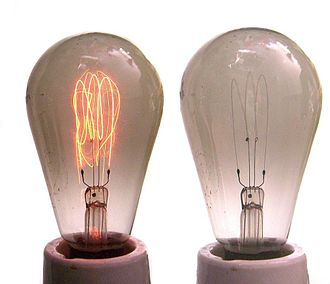
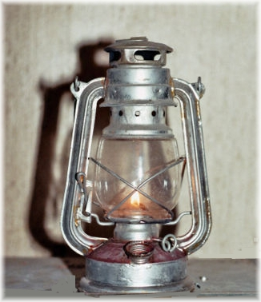

### ¿Qué es una bombilla?

Una bombilla eléctrica es un dispositivo que produce luz a partir de energía eléctrica, esta conversión puede realizarse mediante distintos métodos como el calentamiento por efecto Joule de un filamento metálico, por fluorescencia de ciertos metales ante una descarga eléctrica o por otros sistemas.

### Historia

Joseph Wilson Swan fue el primero en recibir la patente y empezó a instalar bombillas desde comienzos de 1879, sin embargo no fue hasta la llegada de Thomas Alva Edison que la bombilla fue un invento viable fuera de los laboratorios y la cuál en aquel entonces estaba construida con un filamento de carbono.

### Materiales

Las partes de una bombilla consisten en:

- Envoltura, ampolla de vidrio o bulbo.
- Gas inerte. (Comúnmente: Argón).
- Filamento de tungsteno.
- Hilo de contacto (va al pie, al extremo del casquillo).
- Hilo de contacto (va a la rosca del casquillo).
- Alambre(s) de sujeción y disipación de calor del filamento.
- Conducto de refrigeración y soporte interno del filamento.
- Base de contacto.
- Casquillo metálico.
- Aislamiento eléctrico.
- Pie de contacto eléctrico.

### Diseño

A la envoltura de vidrio se le hace el vacío o se llena con un gas inerte para evitar que el filamento sea volátil por las altas temperaturas, por ejemplo se puede rellenar de un gas noble como argón. El tamaño del foco es proporcional a la potencia de esta debido a que a mayor intensidad la temperatura del filamento es más alto, lo que hace necesario una superficie para desprender el calor. El casquillo sirve para fijar el foco en una lámpara y a este casquillo se le conoce como "Rosca Edison", otro tipo de ajuste sería por ejemplo una conexión bayoneta o montaje en bayoneta.

Viendo la historia, ya que los primeros montajes de bombillas fueron hechos por los mismos creadores de estas, es más fácil entender el diseñoy ya que en el momento de su creación su mayor competidor eran las lámparas de queroseno, la bombilla adopta muchas cosas ya que lo que busca es reemplazarla.

El diseño de la envoltura de vidrio redonda es perfecto para la disipación de calor ya que es la mejor forma posible de hacer este procedimiento ya que se aumenta la superficie con el exterior. Continuando por la rosca Edison, esta favorece la facilidad de instalación además de que en el mismo proceso se conecta a la red eléctrica lo que es un diseño inteligente para no tener que añadir más accesorios para hacer estas tareas y logra hacer ambas en un solo paso.

### Conclusión

No hay duda de que el invento de la bombilla electrica fue uno de los más importantes de la historia de la humanidad, ya que permitio a los seres humanos poder continuar trabajando incluso en horarios nocturnos de una mejor forma de lo que lo hacían con las lámparas de queroseno. En la actualidad es imposible imaginar la vida sin estos objetos ya que desde su invento hasta la actualidad ha mejorado mucho la calidad de estos ofreciendonos una calidad superior en iluminación que cualquier otra alternativa artificial.

### Bibliografía

- https://es.wikipedia.org/wiki/L%C3%A1mpara_el%C3%A9ctrica

